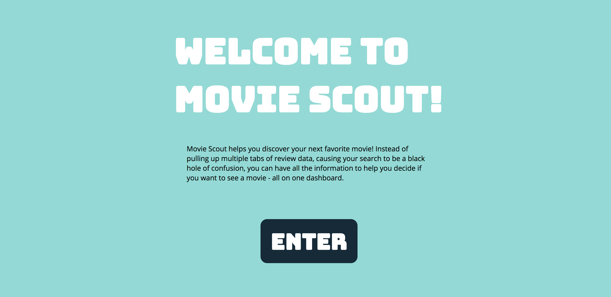
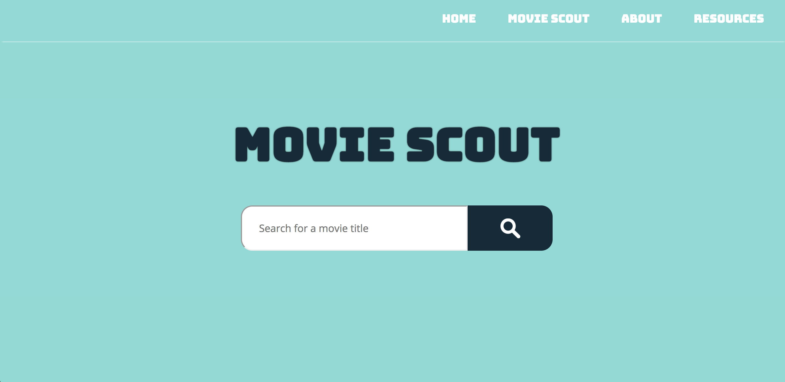
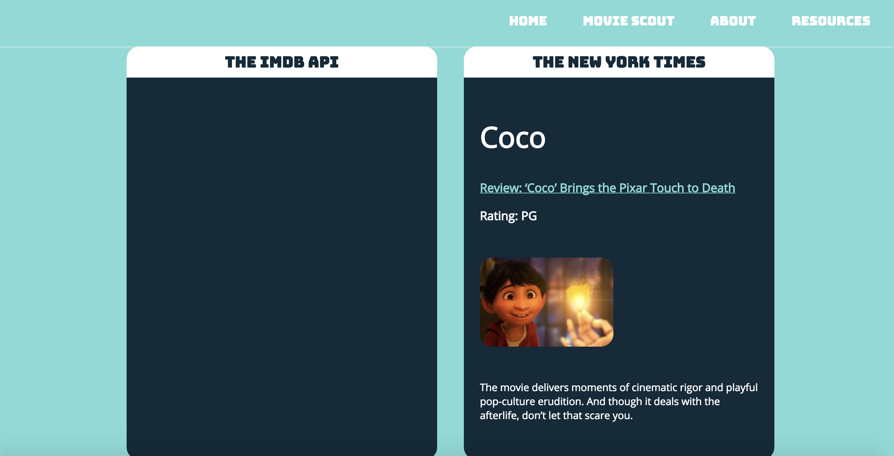

# movie-scout
Thinkful API HACK Capstone #1 project

My first capstone at Thinkful, involving APIs and learning CSS.

SUMMARY: Allows user to pull up data about new film releases on one dashbaord, in order to help users decide which movies are of interest. Currently, the app pulls from IMDB and the New York Times movie reviews.

LANDING PAGE: Includes short descriptions, with an enter into site on click.
 

 
 

API: Users search movie title in search bar.
 

 
 

RESULTS: Results display in cards underneath search bar, and can scroll down page to see results.
 

TECHNOLOGIES USED: HTML, CSS, Javascript and jQuery.

ISSUES: Not optimized for mobile, IMDB API works intermittently.

FIXES: Use a mobile first strategy from the beginning, use an official API with higher chances of
reliability.

